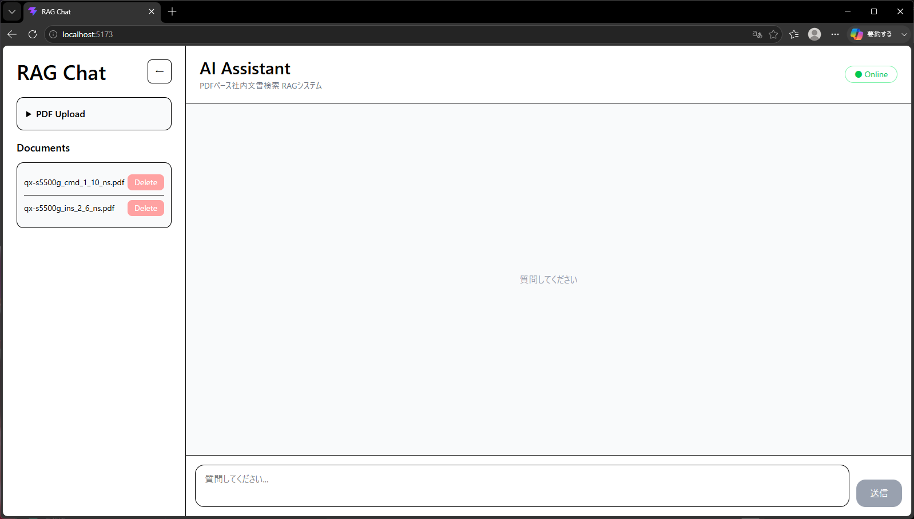
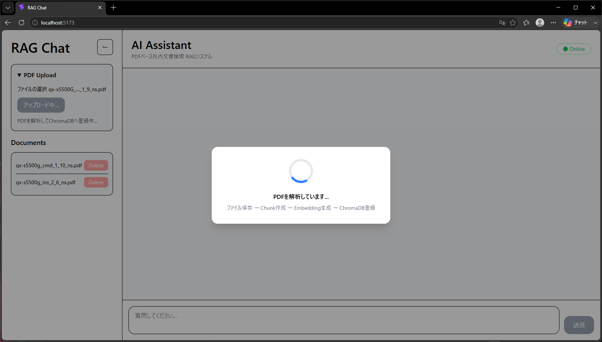
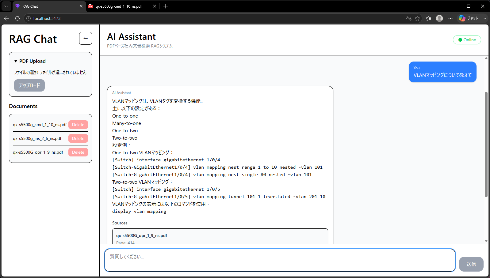

# RAG Chat Application

PDFをアップロードし、内容に対して質問できるRAG（Retrieval Augmented Generation）アプリです。

## アプリ概要

FastAPI + React + ChromaDB + OpenAI API を利用して構築したRAGアプリケーションです。

アップロードしたPDFをベクトル化し、関連文書を検索してAIが回答を生成します。

---

## 機能一覧

- PDFアップロード
- ドキュメント一覧表示
- ドキュメント削除
- RAG検索
- AIチャット
- Source表示
- Chat履歴保持（localStorage）
- Markdown表示対応

---

## 使用技術

### Frontend

- React
- Vite
- Tailwind CSS

### Backend

- FastAPI
- LangChain
- ChromaDB
- OpenAI API

---

## システム構成

```text
PDF
 ↓
PyPDFLoader
 ↓
Chunk分割
 ↓
OpenAI Embedding
 ↓
ChromaDB
 ↓
User Question
 ↓
Embedding
 ↓
Similarity Search
 ↓
Context生成
 ↓
OpenAI GPT
 ↓
Answer + Sources
```

---

## 画面イメージ

### Chat画面



### PDFアップロード



### 回答例



---

## 起動方法

### Frontend

```bash
cd frontend

npm install

npm run dev
```

### Backend

```bash
cd backend

pip install -r requirements.txt

uvicorn app.main:app --reload
```

---

## 環境変数

backend/.env

```env
OPENAI_API_KEY=your_api_key
```

frontend/.env

```env
VITE_API_URL=http://localhost:8000
```

---

## 今後の改善点

- ストリーミングレスポンス対応
- 認証機能追加
- AWSへのデプロイ
- 会話メモリ改善
- LangSmithによるトレーシング
- Docker対応
